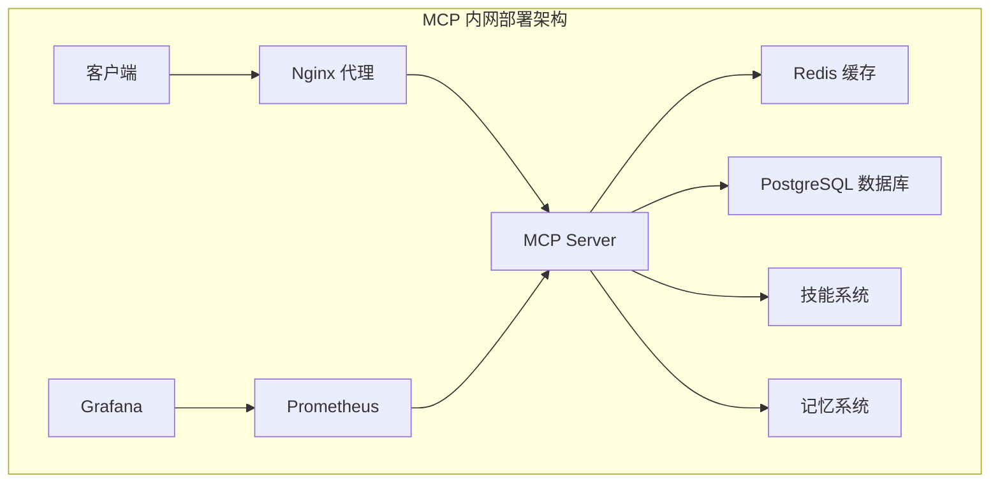

# MCP 内网部署包

## 🎯 项目概述

这是一个完整的 MCP (Model Context Protocol) 内网部署解决方案，包含所有必要的组件、配置和文档，支持完全离线的内网环境部署。

## 📦 包内容

### 🏗️ 核心组件
- **MCP Server** - 主服务，提供 AI Agent 和技能管理
- **Docker 容器化部署** - 完整的容器化解决方案
- **配置管理** - 生产级配置模板
- **监控日志** - 完整的可观测性方案

### 📚 技术文档
- **MCP Guide 教科书** - 系统化的技术指南
- **内网部署指南** - 详细的部署和维护文档
- **最佳实践** - 安全和性能优化指南

### 🛠️ 开发工具
- **打包脚本** - 自动化打包和部署工具
- **配置模板** - 可定制的配置文件
- **监控面板** - Grafana 和 Prometheus 集成

## 🚀 快速开始

### 1. 环境准备
确保系统满足以下要求：
- Linux 操作系统 (CentOS 7+/Ubuntu 18+)
- Docker 20.10+
- Docker Compose 1.29+
- 2GB+ 内存，10GB+ 存储空间

### 2. 获取部署包
```bash
# 在联网环境打包
git clone https://github.com/Noeverer/Noeverer.github.io.git
cd Noeverer.github.io
./mcp-deployment/scripts/package.sh

# 传输到内网环境
scp dist/mcp-server-*.tar.gz user@internal-server:/opt/
```

### 3. 内网部署
```bash
# 解压并部署
cd /opt
tar -xzf mcp-server-*.tar.gz
cd mcp-server-*

# 配置环境变量
vim config/.env

# 执行部署
sudo ./deploy.sh
```

### 4. 验证部署
```bash
# 健康检查
curl http://localhost:8080/health

# 访问 API 文档
open http://localhost:8080/docs
```

## 📊 服务架构



## 📖 文档导航

### 📚 MCP 技术教科书
- [MCP 基础架构与原理](blog/source/_posts/2026/01-tools/mcp-guide/01-mcp-fundamentals.md)
- [AI Agents 系统详解](blog/source/_posts/2026/01-tools/mcp-guide/02-ai-agents.md)
- [Skills 系统开发指南](blog/source/_posts/2026/01-tools/mcp-guide/03-skills-system.md)

### 🛠️ 部署文档
- [内网部署完整指南](mcp-deployment/docs/internal-deployment-guide.md)
- [配置参考](mcp-deployment/config/)
- [Docker 配置](mcp-deployment/docker/)

## 🎯 主要特性

### 🔒 安全性
- 基于角色的访问控制 (RBAC)
- JWT 令牌认证
- 资源访问限制
- SSL/TLS 加密支持

### ⚡ 高性能
- 异步处理架构
- Redis 缓存优化
- 连接池管理
- 负载均衡支持

### 🔧 可扩展性
- 插件化技能系统
- 微服务架构
- 水平扩展支持
- 容器化部署

### 📊 可观测性
- Prometheus 指标收集
- Grafana 监控面板
- 结构化日志记录
- 健康检查机制

## 🛠️ 配置说明

### 核心配置文件

#### `config/.env` - 环境变量
```bash
# 安全配置（必须修改）
MCP_SECRET_KEY=your-very-strong-secret-key
MCP_JWT_SECRET=your-jwt-secret

# 服务配置
MCP_HOST=0.0.0.0
MCP_PORT=8080
MCP_WORKERS=4

# 数据库配置
MCP_DB_TYPE=sqlite
MCP_DB_PATH=/opt/mcp/data/mcp.db

# 缓存配置
MCP_REDIS_HOST=localhost
MCP_REDIS_PORT=6379
MCP_REDIS_PASSWORD=your-redis-password
```

#### `config/mcp-config.json` - 应用配置
详细的系统配置，包括安全策略、存储配置、监控设置等。

### Docker 配置

#### `docker/docker-compose.yml` - 服务编排
定义所有服务的容器化部署配置，包括：
- MCP 主服务
- Redis 缓存
- PostgreSQL 数据库
- Nginx 反向代理
- 监控服务 (Prometheus + Grafana)

#### `docker/Dockerfile` - 容器镜像
MCP 服务的容器镜像构建配置。

## 📊 监控和日志

### 服务监控
- **MCP 服务指标**: http://localhost:9090/metrics
- **Grafana 面板**: http://localhost:3000
- **健康检查**: http://localhost:8080/health

### 日志位置
- 应用日志: `/opt/mcp/logs/mcp-server.log`
- Nginx 日志: `/opt/mcp/logs/nginx.log`
- 容器日志: `docker-compose logs -f`

## 🔧 管理命令

```bash
# 服务管理
cd docker

# 启动所有服务
docker-compose up -d

# 查看服务状态
docker-compose ps

# 查看服务日志
docker-compose logs -f mcp-server

# 重启服务
docker-compose restart mcp-server

# 停止所有服务
docker-compose down

# 完全卸载
./uninstall.sh
```

## 🔒 安全最佳实践

### 1. 密钥管理
- 生成强随机密钥
- 定期轮换密钥
- 使用环境变量存储敏感信息

### 2. 网络安全
- 配置防火墙规则
- 使用 HTTPS 加密
- 限制访问 IP 范围

### 3. 访问控制
- 实施最小权限原则
- 定期审计权限配置
- 使用强密码策略

## 🚨 故障排除

### 常见问题

#### 服务无法启动
```bash
# 检查端口占用
netstat -tlnp | grep :8080

# 查看服务日志
docker-compose logs mcp-server

# 检查配置文件
cat config/.env
```

#### 数据库连接问题
```bash
# 检查数据库服务
docker-compose ps postgres

# 测试连接
docker-compose exec postgres psql -U mcp -d mcp
```

#### 权限问题
```bash
# 检查目录权限
ls -la /opt/mcp/

# 修复权限
sudo chown -R mcp:mcp /opt/mcp/
```

### 性能优化

#### 数据库优化
```sql
-- 创建索引
CREATE INDEX idx_tasks_created_at ON tasks(created_at);

-- 清理过期数据
DELETE FROM memory WHERE created_at < datetime('now', '-30 days');
```

#### 缓存优化
```bash
# 调整 Redis 内存限制
# 在 docker-compose.yml 中配置
command: redis-server --maxmemory 1gb --maxmemory-policy allkeys-lru
```

## 🔄 版本管理

### 升级流程
1. 备份现有数据
2. 停止服务
3. 更新部署包
4. 执行升级脚本
5. 验证服务正常

### 数据备份
```bash
# 执行备份脚本
./scripts/backup.sh

# 自动备份（crontab）
0 2 * * * /opt/mcp/scripts/backup.sh
```

## 📞 技术支持

### 获取帮助
1. 查阅项目文档
2. 检查系统日志
3. 提交 GitHub Issue

### 问题报告
提交问题时请包含：
- 环境信息（操作系统、Docker 版本等）
- 错误日志
- 重现步骤
- 期望行为

## 📄 许可证

本项目遵循 MIT 许可证，详见 [LICENSE](LICENSE) 文件。

## 🤝 贡献指南

欢迎贡献代码、文档或反馈问题：

1. Fork 本仓库
2. 创建功能分支
3. 提交更改
4. 发起 Pull Request

## 📈 项目路线图

### v1.1.0 (计划中)
- [ ] 增加更多技能模板
- [ ] 支持集群部署
- [ ] 增强安全特性
- [ ] 优化性能

### v1.2.0 (计划中)
- [ ] Web 管理界面
- [ ] 更多数据库支持
- [ ] 高级监控功能
- [ ] 自动化运维

---

**感谢使用 MCP 内网部署包！如有问题或建议，欢迎反馈。** 🎉