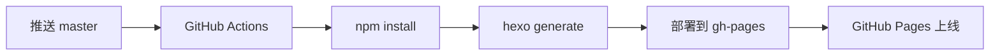

# Ante Liu's Blog

个人博客，基于 [Hexo](https://hexo.io/) 构建，使用 [Butterfly](https://github.com/jerryc127/hexo-theme-butterfly) 主题。

## 项目说明

| 分支 | 用途 |
|------|------|
| `master` | 源码分支，推送此分支触发自动部署 |
| `gh-pages` | 部署分支，存放编译后的静态文件，由 GitHub Actions 自动管理（**请勿手动操作**） |

## 工作流程



1. 在 `master` 分支上编写/修改文章
2. 推送到 GitHub
3. GitHub Actions 自动执行编译和部署
4. 静态文件发布到 `gh-pages` 分支
5. GitHub Pages 自动生效

## 本地开发

```bash
cd blog
npm install
npx hexo server    # 本地预览 http://localhost:4000
npx hexo new 文章名  # 新建文章
npx hexo generate  # 生成静态文件
```

## 发布流程

写文章 → 提交 → 推送 → Action 自动部署，具体步骤：

### 1. 新建文章

```bash
cd blog && npx hexo new "文章标题"
```

文章生成在 `blog/source/_posts/` 目录下，编辑 markdown 文件即可。

### 2. 本地预览（可选）

```bash
cd blog && npx hexo server
```

访问 `http://localhost:4000` 预览效果。

### 3. 提交并推送

```bash
git add .
git commit -m "feat: 添加xxx文章"
git push
```

### 4. 自动部署

推送到 `master` 后，GitHub Actions 自动执行：

```
npm install → hexo clean → hexo generate → 部署到 gh-pages 分支
```

可在仓库 [Actions 页面](https://github.com/Noeverer/Noeverer.github.io/actions) 查看实时进度。

### 5. 校验部署状态

```bash
# 查看最新 Action 运行状态
curl -s "https://api.github.com/repos/Noeverer/Noeverer.github.io/actions/runs?per_page=1&branch=master" \
  | python3 -c "import json,sys; r=json.load(sys.stdin)['workflow_runs'][0]; print(f\"状态: {r['status']}\n结果: {r['conclusion']}\nURL: {r['html_url']}\")"
```

部署成功后，访问 https://noeverer.github.io 查看文章上线。

## 许可证

MIT
