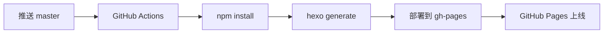

# Ante Liu's Blog

个人博客，基于 [Hexo](https://hexo.io/) 构建，使用 [Butterfly](https://github.com/jerryc127/hexo-theme-butterfly) 主题。

## 项目说明

| 分支 | 用途 |
|------|------|
| `master` | 源码分支，推送此分支触发自动部署 |
| `gh-pages` | 部署分支，存放编译后的静态文件，由 GitHub Actions 自动管理（**请勿手动操作**） |

## 工作流程



1. 在 `master` 分支上编写/修改文章
2. 推送到 GitHub
3. GitHub Actions 自动执行编译和部署
4. 静态文件发布到 `gh-pages` 分支
5. GitHub Pages 自动生效

## 本地开发

```bash
cd blog
npm install
npx hexo server    # 本地预览 http://localhost:4000
npx hexo new 文章名  # 新建文章
npx hexo generate  # 生成静态文件
```

## 许可证

MIT
