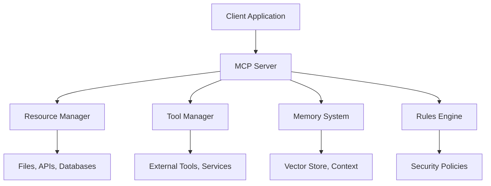
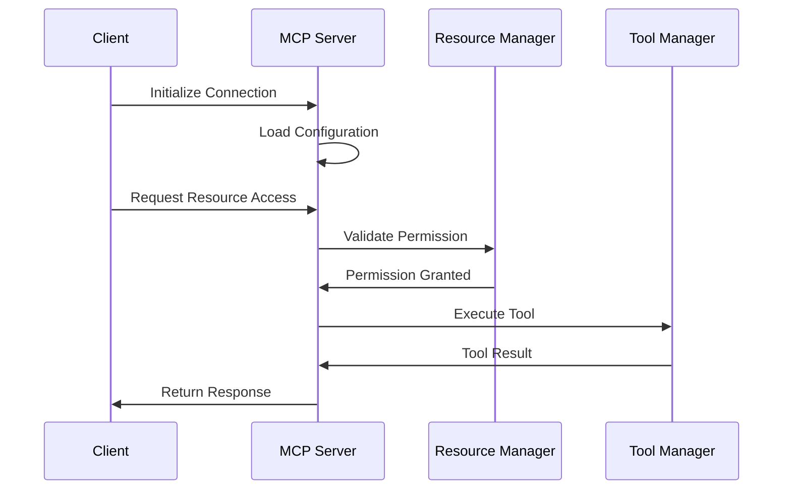

# 第1章：MCP 基础架构与原理

## 📋 本章概述

Model Context Protocol (MCP) 是一个开放标准，用于连接大语言模型与外部数据源和工具。本章将深入介绍 MCP 的核心概念、架构设计和工作原理。

## 🏗️ MCP 核心架构

### 1.1 基本概念

MCP 定义了一套标准化的协议，使得 AI 系统能够：
- 安全地访问外部资源
- 与各种工具和服务集成
- 维护上下文和记忆
- 遵循安全规则和约束

### 1.2 架构组件



#### 核心组件详解

**1. MCP Server**
- 作为中心协调器，处理所有客户端请求
- 管理各个子系统之间的通信
- 提供统一的 API 接口

**2. Resource Manager**
- 管理对文件、API、数据库等资源的访问
- 实现权限控制和审计
- 支持多种数据格式的转换

**3. Tool Manager**
- 集成外部工具和服务
- 提供工具调用接口
- 管理工具生命周期

**4. Memory System**
- 存储和管理对话历史
- 维护长期记忆
- 支持上下文检索

**5. Rules Engine**
- 执行安全策略
- 验证操作权限
- 提供约束机制

## 🔧 MCP 工作流程

### 1.3 消息流处理



### 1.4 生命周期管理

```python
# MCP 服务器生命周期示例
class MCPServer:
    def __init__(self, config):
        self.config = config
        self.resources = ResourceManager(config.resources)
        self.tools = ToolManager(config.tools)
        self.memory = MemorySystem(config.memory)
        self.rules = RulesEngine(config.rules)
    
    async def start(self):
        """启动 MCP 服务器"""
        await self.initialize_components()
        await self.start_listening()
        
    async def process_request(self, request):
        """处理客户端请求"""
        # 1. 验证请求
        if not await self.validate_request(request):
            return self.error_response("Invalid request")
        
        # 2. 执行操作
        result = await self.execute_operation(request)
        
        # 3. 更新记忆
        await self.memory.update_context(request, result)
        
        return result
```

## 🔐 安全机制

### 1.5 权限控制模型

MCP 采用基于角色的访问控制 (RBAC) 模型：

```yaml
# 权限配置示例
permissions:
  roles:
    admin:
      resources: ["*"]
      tools: ["*"]
      operations: ["*"]
    
    user:
      resources: ["files:/home/user/*", "apis:public/*"]
      tools: ["file_reader", "web_search"]
      operations: ["read", "write"]
    
    guest:
      resources: ["files:public/*"]
      tools: ["file_reader"]
      operations: ["read"]

  policies:
    - effect: allow
      role: user
      resource: files:/*
      condition: "file.path.startswith('/home/user/')"
    
    - effect: deny
      role: user
      resource: files:/etc/*
```

### 1.6 数据保护

- **传输加密**：所有通信使用 TLS 1.3
- **存储加密**：敏感数据使用 AES-256 加密
- **访问日志**：完整的操作审计记录
- **数据脱敏**：自动识别和脱敏敏感信息

## 📊 性能考虑

### 1.7 性能优化策略

**1. 缓存机制**
```python
class CacheManager:
    def __init__(self):
        self.cache = {}
        self.ttl = {}
    
    async def get(self, key):
        if key in self.cache and not self._is_expired(key):
            return self.cache[key]
        return None
    
    async def set(self, key, value, ttl=3600):
        self.cache[key] = value
        self.ttl[key] = time.time() + ttl
```

**2. 连接池管理**
```python
class ConnectionPool:
    def __init__(self, max_connections=10):
        self.max_connections = max_connections
        self.connections = asyncio.Queue(maxsize=max_connections)
    
    async def acquire(self):
        return await self.connections.get()
    
    async def release(self, connection):
        await self.connections.put(connection)
```

### 1.8 监控指标

关键性能指标：
- 响应时间 (P50, P95, P99)
- 吞吐量 (requests/second)
- 错误率
- 资源利用率

## 🚀 快速开始

### 1.9 安装和配置

```bash
# 安装 MCP SDK
pip install mcp-sdk

# 初始化项目
mcp init my-project

# 配置服务器
cp config.example.yaml config.yaml
```

### 1.10 基础配置

```yaml
# config.yaml
server:
  host: "0.0.0.0"
  port: 8080
  workers: 4

resources:
  - type: "file"
    path: "/data"
    permissions: "read,write"
  
  - type: "api"
    endpoint: "https://api.example.com"
    auth: "bearer"

tools:
  - name: "file_reader"
    command: "cat"
    args: ["%s"]
  
  - name: "web_search"
    endpoint: "https://search.example.com"
    api_key: "${SEARCH_API_KEY}"

memory:
  type: "vector"
  embedding_model: "text-embedding-ada-002"
  vector_db: "chroma"

rules:
  max_file_size: "100MB"
  allowed_extensions: [".txt", ".md", ".py"]
  rate_limit: "100/minute"
```

## 🎯 最佳实践

### 1.11 设计原则

1. **安全性优先**：所有操作都必须经过权限验证
2. **可扩展性**：支持插件化架构
3. **性能优化**：合理使用缓存和连接池
4. **错误处理**：优雅的错误恢复机制
5. **监控可观测**：完整的日志和指标

### 1.12 常见陷阱

- ❌ 忽略输入验证
- ❌ 硬编码配置信息
- ❌ 缺少错误处理
- ❌ 不合理的资源限制
- ❌ 忽视性能监控

## 📚 小结

本章介绍了 MCP 的基础架构和核心概念。通过理解这些基本原理，您将能够：

- 掌握 MCP 的工作机制
- 理解各组件的职责
- 配置安全的权限控制
- 优化系统性能

下一章将深入探讨 AI Agents 系统的设计和实现。

---

**思考题**：
1. MCP 中的 Resource Manager 和 Tool Manager 有什么区别？
2. 如何设计一个安全的权限控制系统？
3. 在高并发场景下，如何优化 MCP 服务器的性能？