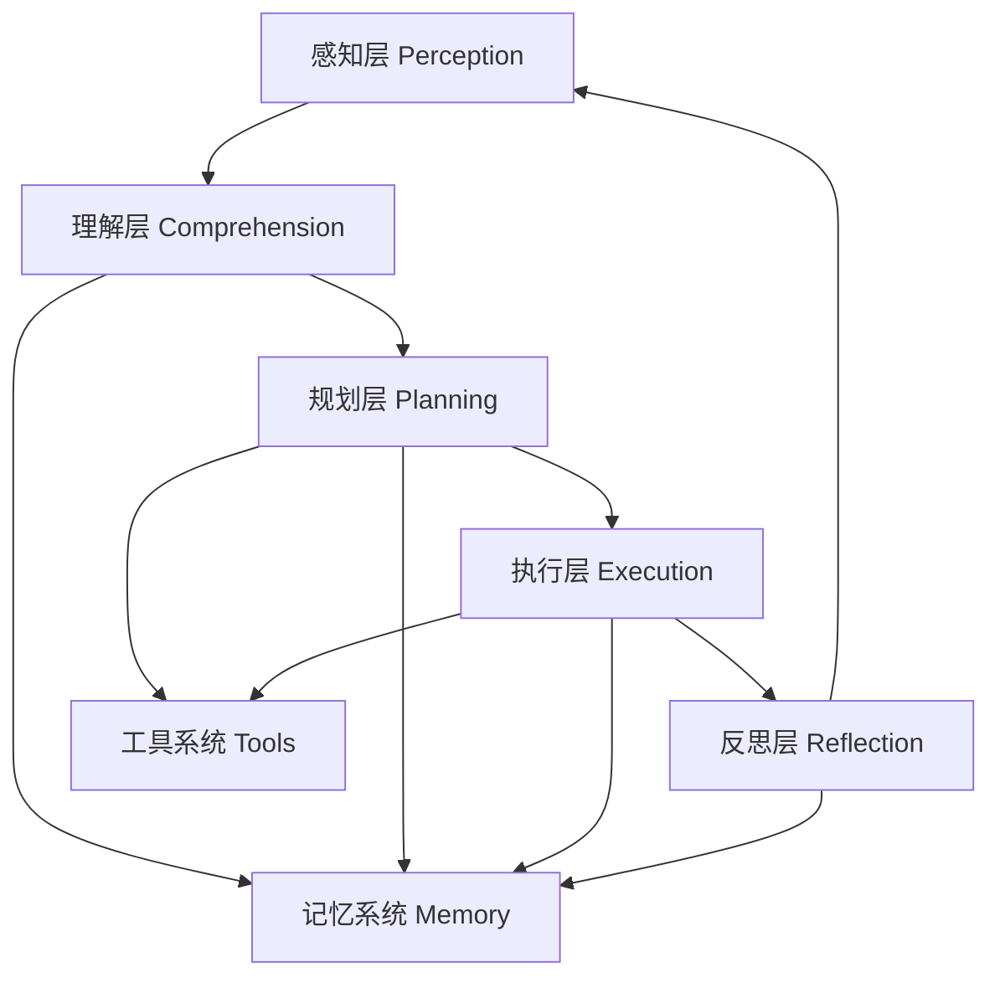

# 第2章：AI Agents 系统详解

## 📋 本章概述

AI Agents 是 MCP 系统的核心智能组件，负责理解用户意图、制定执行计划并协调各种资源完成复杂任务。本章将深入探讨 AI Agents 的架构设计、核心算法和实现细节。

## 🧠 Agent 架构设计

### 2.1 认知架构

现代 AI Agent 通常采用分层认知架构：



#### 各层功能详解

**1. 感知层 (Perception)**
- 接收用户输入
- 环境状态感知
- 多模态信息融合
- 上下文提取

**2. 理解层 (Comprehension)**
- 意图识别
- 语义理解
- 实体抽取
- 情感分析

**3. 规划层 (Planning)**
- 目标分解
- 任务规划
- 资源分配
- 风险评估

**4. 执行层 (Execution)**
- 工具调用
- 动作执行
- 状态监控
- 异常处理

**5. 反思层 (Reflection)**
- 结果评估
- 经验总结
- 策略优化
- 学习更新

### 2.2 核心组件实现

```python
from abc import ABC, abstractmethod
from typing import List, Dict, Any, Optional
from dataclasses import dataclass
from enum import Enum

class AgentState(Enum):
    IDLE = "idle"
    PERCEIVING = "perceiving"
    PLANNING = "planning"
    EXECUTING = "executing"
    REFLECTING = "reflecting"

@dataclass
class Task:
    id: str
    description: str
    priority: int = 1
    dependencies: List[str] = None
    context: Dict[str, Any] = None
    status: str = "pending"

class BaseAgent(ABC):
    def __init__(self, config: Dict[str, Any]):
        self.config = config
        self.state = AgentState.IDLE
        self.memory = MemorySystem(config.get("memory", {}))
        self.tools = ToolManager(config.get("tools", []))
        self.current_task: Optional[Task] = None
        
    async def perceive(self, input_data: Any) -> Dict[str, Any]:
        """感知层：处理输入信息"""
        perception = {
            "input": input_data,
            "entities": await self._extract_entities(input_data),
            "intent": await self._detect_intent(input_data),
            "context": await self._get_context(input_data)
        }
        return perception
    
    async def comprehend(self, perception: Dict[str, Any]) -> Task:
        """理解层：分析并创建任务"""
        task = Task(
            id=self._generate_task_id(),
            description=perception["intent"],
            context={
                "entities": perception["entities"],
                "original_input": perception["input"],
                "context": perception["context"]
            }
        )
        return task
    
    async def plan(self, task: Task) -> List[Dict[str, Any]]:
        """规划层：制定执行计划"""
        plan = []
        subtasks = await self._decompose_task(task)
        
        for subtask in subtasks:
            steps = await self._generate_steps(subtask)
            plan.append({
                "task": subtask,
                "steps": steps,
                "tools": await self._select_tools(subtask)
            })
        
        return plan
    
    async def execute(self, plan: List[Dict[str, Any]]) -> Dict[str, Any]:
        """执行层：执行计划"""
        results = []
        
        for phase in plan:
            phase_results = []
            for step in phase["steps"]:
                tool = self.tools.get_tool(step["tool"])
                result = await tool.execute(step["parameters"])
                phase_results.append(result)
                
                # 检查执行结果，必要时调整计划
                if not await self._validate_result(result, step):
                    adjusted_plan = await self._adjust_plan(step, result)
                    if adjusted_plan:
                        phase["steps"] = adjusted_plan
                        continue
            
            results.append({
                "phase": phase["task"],
                "results": phase_results
            })
        
        return {"execution_results": results}
    
    async def reflect(self, task: Task, results: Dict[str, Any]) -> Dict[str, Any]:
        """反思层：评估和总结"""
        reflection = {
            "task_completion": await self._evaluate_completion(task, results),
            "lessons_learned": await self._extract_lessons(task, results),
            "improvements": await self._suggest_improvements(task, results)
        }
        
        # 更新记忆系统
        await self.memory.update_knowledge(task, results, reflection)
        
        return reflection
```

## 🎯 意图理解和任务分解

### 2.3 意图识别算法

```python
class IntentRecognizer:
    def __init__(self, model_config: Dict[str, Any]):
        self.intent_classifier = self._load_classifier(model_config)
        self.entity_extractor = self._load_extractor(model_config)
        
    async def recognize_intent(self, text: str) -> Dict[str, Any]:
        """识别用户意图"""
        # 1. 文本预处理
        cleaned_text = self._preprocess_text(text)
        
        # 2. 意图分类
        intent_confidence = await self.intent_classifier.predict(cleaned_text)
        
        # 3. 实体抽取
        entities = await self.entity_extractor.extract(cleaned_text)
        
        # 4. 上下文理解
        context = await self._analyze_context(cleaned_text, entities)
        
        return {
            "intent": intent_confidence["intent"],
            "confidence": intent_confidence["confidence"],
            "entities": entities,
            "context": context,
            "complexity": self._assess_complexity(text, entities)
        }
    
    def _assess_complexity(self, text: str, entities: List[Dict]) -> str:
        """评估任务复杂度"""
        word_count = len(text.split())
        entity_count = len(entities)
        
        if word_count <= 10 and entity_count <= 2:
            return "simple"
        elif word_count <= 50 and entity_count <= 5:
            return "medium"
        else:
            return "complex"
```

### 2.4 任务分解策略

```python
class TaskDecomposer:
    def __init__(self, llm_client):
        self.llm = llm_client
        
    async def decompose_task(self, task: Task) -> List[Task]:
        """将复杂任务分解为子任务"""
        prompt = f"""
        请将以下任务分解为可执行的子任务：
        
        任务描述：{task.description}
        上下文信息：{task.context}
        
        请按照以下格式输出：
        1. [子任务1描述]
        2. [子任务2描述]
        ...
        
        每个子任务应该是：
        - 具体可执行的
        - 逻辑上相互独立
        - 能够分配给特定工具处理
        """
        
        response = await self.llm.generate(prompt)
        subtask_descriptions = self._parse_subtasks(response)
        
        subtasks = []
        for i, description in enumerate(subtask_descriptions):
            subtask = Task(
                id=f"{task.id}_{i+1}",
                description=description,
                priority=task.priority,
                dependencies=self._calculate_dependencies(i, subtask_descriptions),
                context=task.context
            )
            subtasks.append(subtask)
        
        return subtasks
    
    async def optimize_task_order(self, tasks: List[Task]) -> List[Task]:
        """优化任务执行顺序"""
        # 使用拓扑排序确保依赖关系正确
        return self._topological_sort(tasks)
```

## 🛠️ 工具选择和调用

### 2.5 智能工具选择

```python
class ToolSelector:
    def __init__(self, tool_registry):
        self.tools = tool_registry
        self.selection_model = self._load_selection_model()
        
    async def select_tools(self, task: Task) -> List[Dict[str, Any]]:
        """为任务选择合适的工具"""
        # 1. 分析任务特征
        task_features = self._extract_task_features(task)
        
        # 2. 候选工具匹配
        candidate_tools = self._match_tools(task_features)
        
        # 3. 工具适用性评分
        scored_tools = []
        for tool in candidate_tools:
            score = await self._score_tool(tool, task)
            if score > 0.5:  # 阈值过滤
                scored_tools.append({"tool": tool, "score": score})
        
        # 4. 工具组合优化
        optimal_tools = await self._optimize_tool_combination(scored_tools)
        
        return optimal_tools
    
    def _extract_task_features(self, task: Task) -> Dict[str, Any]:
        """提取任务特征向量"""
        features = {
            "type": self._classify_task_type(task.description),
            "domain": self._identify_domain(task.context),
            "complexity": task.complexity if hasattr(task, 'complexity') else "medium",
            "data_requirements": self._analyze_data_requirements(task),
            "security_level": self._assess_security_needs(task)
        }
        return features
    
    async def _score_tool(self, tool: Dict[str, Any], task: Task) -> float:
        """评估工具与任务的匹配度"""
        # 多维度评分
        relevance = self._calculate_relevance(tool, task)
        capability = self._assess_capability(tool, task)
        efficiency = self._predict_efficiency(tool, task)
        safety = self._evaluate_safety(tool, task)
        
        # 加权综合评分
        weights = {"relevance": 0.4, "capability": 0.3, "efficiency": 0.2, "safety": 0.1}
        score = (
            relevance * weights["relevance"] +
            capability * weights["capability"] +
            efficiency * weights["efficiency"] +
            safety * weights["safety"]
        )
        
        return score
```

### 2.6 工具调用执行

```python
class ToolExecutor:
    def __init__(self, config: Dict[str, Any]):
        self.config = config
        self.execution_pool = AsyncExecutorPool(config.get("max_concurrent", 5))
        self.retry_manager = RetryManager(config.get("retry_policy", {}))
        
    async def execute_tool(self, tool: Dict[str, Any], parameters: Dict[str, Any]) -> Dict[str, Any]:
        """执行工具调用"""
        # 1. 参数验证
        validated_params = await self._validate_parameters(tool, parameters)
        
        # 2. 安全检查
        await self._security_check(tool, validated_params)
        
        # 3. 执行工具
        async with self.execution_pool.acquire() as executor:
            result = await self.retry_manager.execute(
                executor.run_tool,
                tool["name"],
                validated_params
            )
        
        # 4. 结果后处理
        processed_result = await self._post_process_result(result, tool)
        
        return processed_result
    
    async def _validate_parameters(self, tool: Dict[str, Any], parameters: Dict[str, Any]) -> Dict[str, Any]:
        """验证和标准化参数"""
        schema = tool.get("parameters", {})
        validator = ParameterValidator(schema)
        
        return await validator.validate(parameters)
    
    async def _security_check(self, tool: Dict[str, Any], parameters: Dict[str, Any]):
        """安全检查"""
        # 检查是否有恶意参数
        if self._detect_malicious_input(parameters):
            raise SecurityError("Malicious input detected")
        
        # 检查权限
        required_permissions = tool.get("required_permissions", [])
        if not await self._check_permissions(required_permissions):
            raise PermissionError("Insufficient permissions")
```

## 🔄 执行监控和自适应

### 2.7 实时监控系统

```python
class ExecutionMonitor:
    def __init__(self, config: Dict[str, Any]):
        self.config = config
        self.metrics_collector = MetricsCollector()
        self.alert_manager = AlertManager(config.get("alerts", {}))
        
    async def monitor_execution(self, agent: BaseAgent, task: Task):
        """监控任务执行过程"""
        execution_id = self._generate_execution_id()
        
        # 启动监控协程
        monitor_task = asyncio.create_task(
            self._monitor_task(execution_id, agent, task)
        )
        
        try:
            result = await agent.execute_task(task)
            await self._record_success(execution_id, result)
            return result
        except Exception as e:
            await self._record_failure(execution_id, e)
            await self._trigger_alert(execution_id, e)
            raise
        finally:
            monitor_task.cancel()
    
    async def _monitor_task(self, execution_id: str, agent: BaseAgent, task: Task):
        """实时监控任务状态"""
        start_time = time.time()
        
        while True:
            # 收集指标
            metrics = {
                "execution_id": execution_id,
                "timestamp": time.time(),
                "agent_state": agent.state.value,
                "progress": agent.get_progress(),
                "resource_usage": await self._get_resource_usage(),
                "errors": agent.get_errors()
            }
            
            await self.metrics_collector.record(metrics)
            
            # 检查异常
            if await self._detect_anomaly(metrics):
                await self._handle_anomaly(execution_id, metrics)
            
            # 检查超时
            if time.time() - start_time > self.config.get("timeout", 300):
                await agent.cancel_task("Timeout")
                break
            
            await asyncio.sleep(1)  # 1秒监控间隔
```

### 2.8 自适应学习机制

```python
class AdaptiveLearning:
    def __init__(self, config: Dict[str, Any]):
        self.config = config
        self.experience_db = ExperienceDatabase()
        self.learning_model = self._load_learning_model()
        
    async def learn_from_execution(self, agent: BaseAgent, task: Task, result: Dict[str, Any]):
        """从执行过程中学习"""
        # 1. 提取执行经验
        experience = await self._extract_experience(agent, task, result)
        
        # 2. 分析执行模式
        patterns = await self._analyze_patterns(experience)
        
        # 3. 更新决策模型
        await self._update_decision_model(patterns)
        
        # 4. 优化策略
        await self._optimize_strategies(patterns)
    
    async def _extract_experience(self, agent: BaseAgent, task: Task, result: Dict[str, Any]) -> Dict[str, Any]:
        """提取执行经验"""
        experience = {
            "task_id": task.id,
            "task_type": self._classify_task_type(task),
            "execution_plan": agent.execution_plan,
            "tool_usage": agent.tool_usage_history,
            "success_indicators": self._calculate_success_indicators(result),
            "performance_metrics": agent.performance_metrics,
            "error_patterns": agent.error_patterns,
            "context": task.context
        }
        return experience
    
    async def _optimize_strategies(self, patterns: Dict[str, Any]):
        """基于学习模式优化策略"""
        for pattern in patterns["successful_patterns"]:
            # 优化工具选择策略
            if pattern["type"] == "tool_selection":
                await self._optimize_tool_selection(pattern)
            
            # 优化任务规划策略
            elif pattern["type"] == "task_planning":
                await self._optimize_task_planning(pattern)
            
            # 优化执行策略
            elif pattern["type"] == "execution":
                await self._optimize_execution_strategy(pattern)
```

## 🎯 最佳实践

### 2.9 Agent 设计原则

**1. 模块化设计**
```python
# 好的设计
class ModularAgent(BaseAgent):
    def __init__(self, config):
        super().__init__(config)
        self.perception_module = PerceptionModule(config.get("perception"))
        self.planning_module = PlanningModule(config.get("planning"))
        self.execution_module = ExecutionModule(config.get("execution"))

# 避免的设计
class MonolithicAgent:
    def __init__(self, config):
        # 所有逻辑混在一个类中
        pass
```

**2. 状态管理**
```python
class AgentStateManager:
    def __init__(self):
        self.state_history = []
        self.current_state = AgentState.IDLE
        
    async def transition_to(self, new_state: AgentState, context: Dict[str, Any]):
        """安全的状态转换"""
        if self._is_valid_transition(self.current_state, new_state):
            self.state_history.append(self.current_state)
            self.current_state = new_state
            await self._notify_state_change(new_state, context)
        else:
            raise InvalidStateTransition(f"Cannot transition from {self.current_state} to {new_state}")
```

### 2.10 性能优化

**1. 异步并发**
```python
async def parallel_execution(agent, tasks):
    """并行执行多个任务"""
    semaphore = asyncio.Semaphore(5)  # 限制并发数
    
    async def execute_with_limit(task):
        async with semaphore:
            return await agent.execute_task(task)
    
    results = await asyncio.gather(
        *[execute_with_limit(task) for task in tasks],
        return_exceptions=True
    )
    return results
```

**2. 缓存策略**
```python
class PlanCache:
    def __init__(self, max_size=1000, ttl=3600):
        self.cache = LRUCache(max_size)
        self.ttl = ttl
        
    async def get_plan(self, task_signature: str) -> Optional[List[Dict]]:
        """获取缓存的计划"""
        if task_signature in self.cache:
            plan, timestamp = self.cache[task_signature]
            if time.time() - timestamp < self.ttl:
                return plan
        return None
    
    async def cache_plan(self, task_signature: str, plan: List[Dict]):
        """缓存执行计划"""
        self.cache[task_signature] = (plan, time.time())
```

## 📚 小结

本章深入探讨了 AI Agents 的核心组件和实现细节：

- **认知架构**：分层处理复杂任务
- **意图理解**：准确识别用户需求
- **任务分解**：将复杂问题拆解为可执行步骤
- **工具选择**：智能匹配最佳工具组合
- **执行监控**：实时跟踪和异常处理
- **自适应学习**：从经验中持续优化

下一章将介绍 Skills 系统的开发方法，展示如何为 Agent 构建强大的能力库。

---

**思考题**：
1. 如何设计一个既能处理简单任务又能应对复杂场景的 Agent 架构？
2. 在任务执行过程中，如何平衡执行效率和安全性？
3. 如何评估和优化 Agent 的学习能力？