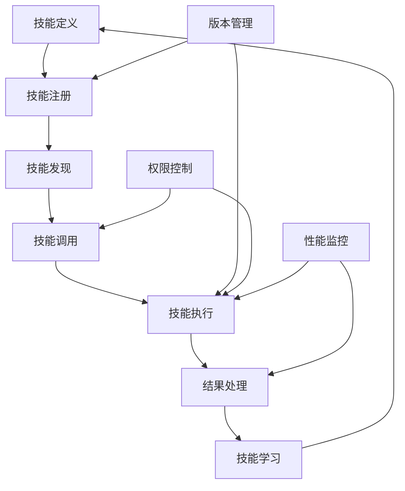

# 第3章：Skills 系统开发指南

## 📋 本章概述

Skills 系统是 MCP 架构中的能力层，定义了 Agent 可以执行的具体操作和技能。本章将详细介绍如何设计、开发和部署高质量的 Skills，以及如何构建可扩展的技能生态系统。

## 🎯 Skills 架构设计

### 3.1 Skills 生命周期



### 3.2 核心 Skill 接口

```python
from abc import ABC, abstractmethod
from typing import Dict, List, Any, Optional, Union
from dataclasses import dataclass, field
from enum import Enum
import asyncio

class SkillType(Enum):
    TOOL = "tool"           # 工具类技能
    ANALYSIS = "analysis"   # 分析类技能
    GENERATION = "generation" # 生成类技能
    INTEGRATION = "integration" # 集成类技能
    AUTOMATION = "automation" # 自动化技能

class SkillStatus(Enum):
    ACTIVE = "active"
    INACTIVE = "inactive"
    DEPRECATED = "deprecated"
    TESTING = "testing"

@dataclass
class SkillMetadata:
    name: str
    description: str
    version: str
    author: str
    skill_type: SkillType
    category: str
    tags: List[str] = field(default_factory=list)
    dependencies: List[str] = field(default_factory=list)
    requirements: Dict[str, Any] = field(default_factory=dict)
    permissions: List[str] = field(default_factory=list)
    parameters: Dict[str, Any] = field(default_factory=dict)
    examples: List[Dict[str, Any]] = field(default_factory=list)

class BaseSkill(ABC):
    def __init__(self, config: Dict[str, Any]):
        self.config = config
        self.metadata = self._define_metadata()
        self.status = SkillStatus.ACTIVE
        self.execution_history = []
        self.performance_metrics = {}
        
    @abstractmethod
    def _define_metadata(self) -> SkillMetadata:
        """定义技能元数据"""
        pass
    
    @abstractmethod
    async def execute(self, parameters: Dict[str, Any]) -> Dict[str, Any]:
        """执行技能核心逻辑"""
        pass
    
    async def validate_parameters(self, parameters: Dict[str, Any]) -> bool:
        """验证输入参数"""
        schema = self.metadata.parameters
        validator = ParameterValidator(schema)
        return await validator.validate(parameters)
    
    async def before_execution(self, parameters: Dict[str, Any]) -> Dict[str, Any]:
        """执行前钩子"""
        # 权限检查
        await self._check_permissions()
        
        # 资源准备
        await self._prepare_resources(parameters)
        
        return parameters
    
    async def after_execution(self, result: Dict[str, Any]) -> Dict[str, Any]:
        """执行后钩子"""
        # 结果后处理
        processed_result = await self._process_result(result)
        
        # 性能记录
        await self._record_performance(processed_result)
        
        return processed_result
    
    async def run(self, parameters: Dict[str, Any]) -> Dict[str, Any]:
        """完整的技能执行流程"""
        execution_id = self._generate_execution_id()
        start_time = time.time()
        
        try:
            # 1. 参数验证
            if not await self.validate_parameters(parameters):
                raise ValueError("Invalid parameters")
            
            # 2. 执行前处理
            processed_params = await self.before_execution(parameters)
            
            # 3. 核心执行
            result = await self.execute(processed_params)
            
            # 4. 执行后处理
            final_result = await self.after_execution(result)
            
            # 5. 记录执行历史
            execution_time = time.time() - start_time
            await self._record_execution(execution_id, parameters, final_result, execution_time, True)
            
            return {
                "success": True,
                "result": final_result,
                "execution_id": execution_id,
                "execution_time": execution_time
            }
            
        except Exception as e:
            execution_time = time.time() - start_time
            await self._record_execution(execution_id, parameters, str(e), execution_time, False)
            
            return {
                "success": False,
                "error": str(e),
                "execution_id": execution_id,
                "execution_time": execution_time
            }
```

## 🛠️ 技能开发实践

### 3.3 工具类技能开发

```python
class FileOperationSkill(BaseSkill):
    """文件操作技能示例"""
    
    def _define_metadata(self) -> SkillMetadata:
        return SkillMetadata(
            name="file_operations",
            description="Perform file system operations",
            version="1.0.0",
            author="MCP Team",
            skill_type=SkillType.TOOL,
            category="filesystem",
            tags=["file", "read", "write", "delete"],
            permissions=["file_read", "file_write"],
            parameters={
                "type": "object",
                "properties": {
                    "operation": {
                        "type": "string",
                        "enum": ["read", "write", "delete", "list"],
                        "description": "Operation to perform"
                    },
                    "path": {
                        "type": "string",
                        "description": "File or directory path"
                    },
                    "content": {
                        "type": "string",
                        "description": "Content to write (for write operation)"
                    }
                },
                "required": ["operation", "path"]
            },
            examples=[
                {
                    "description": "Read a file",
                    "parameters": {
                        "operation": "read",
                        "path": "/path/to/file.txt"
                    }
                }
            ]
        )
    
    async def execute(self, parameters: Dict[str, Any]) -> Dict[str, Any]:
        operation = parameters["operation"]
        path = parameters["path"]
        
        if operation == "read":
            return await self._read_file(path)
        elif operation == "write":
            content = parameters["content"]
            return await self._write_file(path, content)
        elif operation == "delete":
            return await self._delete_file(path)
        elif operation == "list":
            return await self._list_directory(path)
        else:
            raise ValueError(f"Unsupported operation: {operation}")
    
    async def _read_file(self, path: str) -> Dict[str, Any]:
        """安全读取文件"""
        # 路径安全检查
        if not self._is_safe_path(path):
            raise SecurityError(f"Unsafe path: {path}")
        
        try:
            async with aiofiles.open(path, 'r') as file:
                content = await file.read()
            
            return {
                "content": content,
                "size": len(content),
                "path": path
            }
        except Exception as e:
            raise FileOperationError(f"Failed to read file {path}: {str(e)}")
    
    def _is_safe_path(self, path: str) -> bool:
        """检查路径安全性"""
        # 实现路径安全检查逻辑
        resolved_path = pathlib.Path(path).resolve()
        safe_dirs = self.config.get("safe_directories", ["/tmp"])
        return any(str(resolved_path).startswith(safe_dir) for safe_dir in safe_dirs)
```

### 3.4 分析类技能开发

```python
class TextAnalysisSkill(BaseSkill):
    """文本分析技能示例"""
    
    def _define_metadata(self) -> SkillMetadata:
        return SkillMetadata(
            name="text_analysis",
            description="Advanced text analysis and insights",
            version="2.1.0",
            author="AI Team",
            skill_type=SkillType.ANALYSIS,
            category="nlp",
            tags=["text", "analysis", "sentiment", "entities"],
            dependencies=["spacy", "transformers"],
            requirements={
                "models": ["en_core_web_sm"],
                "memory": "2GB"
            }
        )
    
    def __init__(self, config: Dict[str, Any]):
        super().__init__(config)
        self.nlp_model = None
        self.sentiment_analyzer = None
    
    async def initialize(self):
        """初始化模型和资源"""
        import spacy
        from transformers import pipeline
        
        self.nlp_model = spacy.load("en_core_web_sm")
        self.sentiment_analyzer = pipeline("sentiment-analysis")
    
    async def execute(self, parameters: Dict[str, Any]) -> Dict[str, Any]:
        text = parameters["text"]
        analysis_type = parameters.get("analysis_type", "comprehensive")
        
        if analysis_type == "sentiment":
            return await self._analyze_sentiment(text)
        elif analysis_type == "entities":
            return await self._extract_entities(text)
        elif analysis_type == "comprehensive":
            return await self._comprehensive_analysis(text)
        else:
            raise ValueError(f"Unknown analysis type: {analysis_type}")
    
    async def _comprehensive_analysis(self, text: str) -> Dict[str, Any]:
        """综合文本分析"""
        # 并行执行多种分析
        tasks = [
            self._analyze_sentiment(text),
            self._extract_entities(text),
            self._analyze_keywords(text),
            self._analyze_readability(text)
        ]
        
        results = await asyncio.gather(*tasks)
        
        return {
            "sentiment": results[0],
            "entities": results[1],
            "keywords": results[2],
            "readability": results[3],
            "text_stats": self._calculate_text_stats(text)
        }
    
    async def _analyze_sentiment(self, text: str) -> Dict[str, Any]:
        """情感分析"""
        if not self.sentiment_analyzer:
            await self.initialize()
        
        result = self.sentiment_analyzer(text)[0]
        
        return {
            "label": result["label"],
            "score": result["score"],
            "confidence": max(result["score"], 1 - result["score"])
        }
    
    async def _extract_entities(self, text: str) -> List[Dict[str, Any]]:
        """实体抽取"""
        if not self.nlp_model:
            await self.initialize()
        
        doc = self.nlp_model(text)
        entities = []
        
        for ent in doc.ents:
            entities.append({
                "text": ent.text,
                "label": ent.label_,
                "description": spacy.explain(ent.label_),
                "start": ent.start_char,
                "end": ent.end_char,
                "confidence": 0.8  # 可以根据实际情况调整
            })
        
        return entities
```

### 3.5 生成类技能开发

```python
class ContentGenerationSkill(BaseSkill):
    """内容生成技能示例"""
    
    def _define_metadata(self) -> SkillMetadata:
        return SkillMetadata(
            name="content_generation",
            description="Generate various types of content using AI models",
            version="1.5.0",
            author="Content Team",
            skill_type=SkillType.GENERATION,
            category="creative",
            tags=["generation", "writing", "creative"],
            dependencies=["openai", "transformers"],
            requirements={
                "api_keys": ["openai"],
                "models": ["gpt-4"]
            }
        )
    
    async def execute(self, parameters: Dict[str, Any]) -> Dict[str, Any]:
        content_type = parameters["content_type"]
        prompt = parameters["prompt"]
        options = parameters.get("options", {})
        
        if content_type == "blog_post":
            return await self._generate_blog_post(prompt, options)
        elif content_type == "email":
            return await self._generate_email(prompt, options)
        elif content_type == "code":
            return await self._generate_code(prompt, options)
        elif content_type == "creative_writing":
            return await self._generate_creative_content(prompt, options)
        else:
            raise ValueError(f"Unsupported content type: {content_type}")
    
    async def _generate_blog_post(self, prompt: str, options: Dict[str, Any]) -> Dict[str, Any]:
        """生成博客文章"""
        # 构建专门的提示模板
        system_prompt = f"""
        You are a professional blog writer. Generate a well-structured blog post based on the user's prompt.
        
        Requirements:
        - Title: Catchy and relevant
        - Structure: Introduction, Body paragraphs, Conclusion
        - Length: {options.get('word_count', 800)} words
        - Tone: {options.get('tone', 'informative')}
        - Target audience: {options.get('audience', 'general')}
        """
        
        response = await self._call_llm(prompt, system_prompt)
        
        return {
            "content": response["content"],
            "title": self._extract_title(response["content"]),
            "word_count": len(response["content"].split()),
            "estimated_reading_time": len(response["content"].split()) / 200  # 假设每分钟200词
        }
    
    async def _generate_code(self, prompt: str, options: Dict[str, Any]) -> Dict[str, Any]:
        """生成代码"""
        language = options.get("language", "python")
        framework = options.get("framework", "")
        
        system_prompt = f"""
        You are an expert programmer. Generate clean, efficient, and well-documented {language} code.
        
        Requirements:
        - Follow best practices and coding standards
        - Include appropriate comments
        - Handle edge cases
        - Write testable code
        {"Use " + framework + " framework." if framework else ""}
        """
        
        response = await self._call_llm(prompt, system_prompt)
        
        return {
            "code": response["content"],
            "language": language,
            "explanation": await self._generate_code_explanation(response["content"]),
            "tests": await self._generate_unit_tests(response["content"], language)
        }
```

## 🔧 技能管理系统

### 3.6 技能注册和发现

```python
class SkillRegistry:
    """技能注册中心"""
    
    def __init__(self, config: Dict[str, Any]):
        self.config = config
        self.skills = {}
        self.skill_index = {}
        self.dependency_graph = {}
        
    async def register_skill(self, skill: BaseSkill) -> bool:
        """注册新技能"""
        try:
            # 1. 验证技能定义
            await self._validate_skill(skill)
            
            # 2. 检查依赖
            await self._check_dependencies(skill)
            
            # 3. 注册技能
            self.skills[skill.metadata.name] = skill
            
            # 4. 更新索引
            await self._update_index(skill)
            
            # 5. 构建依赖图
            await self._build_dependency_graph(skill)
            
            return True
            
        except Exception as e:
            logger.error(f"Failed to register skill {skill.metadata.name}: {str(e)}")
            return False
    
    async def discover_skills(self, criteria: Dict[str, Any]) -> List[BaseSkill]:
        """技能发现和匹配"""
        matching_skills = []
        
        for skill in self.skills.values():
            if await self._matches_criteria(skill, criteria):
                matching_skills.append(skill)
        
        # 按相关性排序
        matching_skills.sort(
            key=lambda s: self._calculate_relevance(s, criteria),
            reverse=True
        )
        
        return matching_skills
    
    async def _matches_criteria(self, skill: BaseSkill, criteria: Dict[str, Any]) -> bool:
        """检查技能是否匹配条件"""
        # 按类型匹配
        if "skill_type" in criteria:
            if skill.metadata.skill_type != criteria["skill_type"]:
                return False
        
        # 按类别匹配
        if "category" in criteria:
            if skill.metadata.category != criteria["category"]:
                return False
        
        # 按标签匹配
        if "tags" in criteria:
            required_tags = set(criteria["tags"])
            skill_tags = set(skill.metadata.tags)
            if not required_tags.issubset(skill_tags):
                return False
        
        # 按能力匹配
        if "capabilities" in criteria:
            if not await self._check_capabilities(skill, criteria["capabilities"]):
                return False
        
        return True
```

### 3.7 技能版本管理

```python
class SkillVersionManager:
    """技能版本管理器"""
    
    def __init__(self, storage_backend):
        self.storage = storage_backend
        self.active_versions = {}
        
    async def create_version(self, skill: BaseSkill, release_notes: str) -> str:
        """创建新版本"""
        version_id = self._generate_version_id(skill.metadata.name, skill.metadata.version)
        
        version_info = {
            "version_id": version_id,
            "skill_name": skill.metadata.name,
            "version": skill.metadata.version,
            "release_notes": release_notes,
            "created_at": datetime.utcnow(),
            "skill_definition": self._serialize_skill(skill),
            "metadata": asdict(skill.metadata)
        }
        
        await self.storage.store_version(version_info)
        
        return version_id
    
    async def deploy_version(self, skill_name: str, version: str) -> bool:
        """部署指定版本"""
        try:
            # 1. 获取版本信息
            version_info = await self.storage.get_version(skill_name, version)
            if not version_info:
                raise ValueError(f"Version {version} not found for skill {skill_name}")
            
            # 2. 验证版本兼容性
            await self._validate_compatibility(version_info)
            
            # 3. 停止当前版本
            if skill_name in self.active_versions:
                await self._stop_skill(skill_name)
            
            # 4. 启动新版本
            skill = await self._deserialize_skill(version_info["skill_definition"])
            await skill.initialize()
            
            # 5. 更新活跃版本映射
            self.active_versions[skill_name] = {
                "skill": skill,
                "version": version,
                "deployed_at": datetime.utcnow()
            }
            
            return True
            
        except Exception as e:
            logger.error(f"Failed to deploy version {version} of skill {skill_name}: {str(e)}")
            return False
    
    async def rollback(self, skill_name: str, target_version: str) -> bool:
        """回滚到指定版本"""
        try:
            # 获取历史版本
            current_version = self.active_versions[skill_name]["version"]
            
            # 执行回滚
            success = await self.deploy_version(skill_name, target_version)
            
            if success:
                logger.info(f"Successfully rolled back skill {skill_name} from {current_version} to {target_version}")
            
            return success
            
        except Exception as e:
            logger.error(f"Rollback failed for skill {skill_name}: {str(e)}")
            return False
```

## 📊 性能优化和监控

### 3.8 技能性能监控

```python
class SkillMonitor:
    """技能性能监控"""
    
    def __init__(self, config: Dict[str, Any]):
        self.config = config
        self.metrics_collector = MetricsCollector()
        self.alert_manager = AlertManager()
        
    async def monitor_skill_execution(self, skill: BaseSkill, execution_context: Dict[str, Any]):
        """监控技能执行"""
        execution_id = self._generate_execution_id()
        start_time = time.time()
        
        # 开始监控
        monitoring_task = asyncio.create_task(
            self._collect_metrics(execution_id, skill)
        )
        
        try:
            # 执行技能
            result = await skill.run(execution_context["parameters"])
            
            # 记录成功指标
            execution_time = time.time() - start_time
            await self._record_success_metrics(execution_id, skill, result, execution_time)
            
            return result
            
        except Exception as e:
            # 记录失败指标
            execution_time = time.time() - start_time
            await self._record_failure_metrics(execution_id, skill, e, execution_time)
            
            # 触发告警
            await self._trigger_alert(skill, e)
            
            raise
            
        finally:
            monitoring_task.cancel()
    
    async def _collect_metrics(self, execution_id: str, skill: BaseSkill):
        """实时收集执行指标"""
        while True:
            try:
                # 收集系统指标
                system_metrics = await self._get_system_metrics()
                
                # 收集技能特定指标
                skill_metrics = await skill.get_runtime_metrics()
                
                # 存储指标
                await self.metrics_collector.record({
                    "execution_id": execution_id,
                    "timestamp": time.time(),
                    "system": system_metrics,
                    "skill": skill_metrics
                })
                
                # 检查异常
                await self._check_anomalies(skill, system_metrics, skill_metrics)
                
                await asyncio.sleep(1)  # 1秒采样间隔
                
            except asyncio.CancelledError:
                break
            except Exception as e:
                logger.error(f"Metrics collection error: {str(e)}")
```

### 3.9 技能优化策略

```python
class SkillOptimizer:
    """技能优化器"""
    
    def __init__(self, config: Dict[str, Any]):
        self.config = config
        self.optimization_strategies = {}
        
    async def optimize_skill(self, skill: BaseSkill, performance_data: List[Dict]) -> BaseSkill:
        """基于性能数据优化技能"""
        # 1. 分析性能瓶颈
        bottlenecks = await self._analyze_bottlenecks(skill, performance_data)
        
        # 2. 选择优化策略
        strategies = await self._select_optimization_strategies(bottlenecks)
        
        # 3. 应用优化
        optimized_skill = skill
        for strategy in strategies:
            optimized_skill = await strategy.apply(optimized_skill, performance_data)
        
        # 4. 验证优化效果
        validation_result = await self._validate_optimization(skill, optimized_skill)
        
        return optimized_skill if validation_result.success else skill
    
    async def _analyze_bottlenecks(self, skill: BaseSkill, data: List[Dict]) -> List[Dict]:
        """分析性能瓶颈"""
        bottlenecks = []
        
        # 分析执行时间
        execution_times = [d["execution_time"] for d in data]
        if statistics.mean(execution_times) > self.config.get("max_execution_time", 5.0):
            bottlenecks.append({
                "type": "execution_time",
                "severity": "high",
                "details": f"Average execution time: {statistics.mean(execution_times):.2f}s"
            })
        
        # 分析内存使用
        memory_usage = [d.get("memory_usage", 0) for d in data]
        if max(memory_usage) > self.config.get("max_memory_usage", 1024):
            bottlenecks.append({
                "type": "memory_usage",
                "severity": "medium",
                "details": f"Peak memory usage: {max(memory_usage)}MB"
            })
        
        # 分析错误率
        error_rate = len([d for d in data if not d["success"]]) / len(data)
        if error_rate > self.config.get("max_error_rate", 0.05):
            bottlenecks.append({
                "type": "error_rate",
                "severity": "high",
                "details": f"Error rate: {error_rate:.2%}"
            })
        
        return bottlenecks
```

## 🎯 最佳实践

### 3.10 技能设计原则

**1. 单一职责原则**
```python
# 好的设计 - 职责明确
class TextToSpeechSkill(BaseSkill):
    """专门负责文本转语音"""
    async def execute(self, parameters):
        return await self._convert_text_to_speech(parameters["text"])

# 避免 - 职责混乱
class MediaProcessorSkill(BaseSkill):
    """处理文本、音频、视频、图像 - 职责过多"""
```

**2. 幂等性设计**
```python
async def execute(self, parameters):
    # 确保重复执行产生相同结果
    operation_id = self._generate_operation_id(parameters)
    
    if await self._is_completed(operation_id):
        return await self._get_result(operation_id)
    
    result = await self._perform_operation(parameters)
    await self._store_result(operation_id, result)
    
    return result
```

**3. 优雅降级**
```python
async def execute(self, parameters):
    try:
        # 尝试使用最佳模型
        return await self._execute_with_full_model(parameters)
    except ModelNotAvailableError:
        try:
            # 降级到轻量级模型
            return await self._execute_with_lightweight_model(parameters)
        except Exception:
            # 返回基本响应
            return await self._execute_with_basic_method(parameters)
```

## 📚 小结

本章详细介绍了 Skills 系统的开发和管理：

- **技能架构**：标准化的技能接口和生命周期管理
- **开发实践**：不同类型技能的具体实现方法
- **管理系统**：技能注册、发现和版本控制
- **性能优化**：监控、分析和优化策略
- **最佳实践**：设计原则和常见陷阱

下一章将介绍 Memories 系统，展示如何为 Agent 构建持久化的记忆和学习能力。

---

**思考题**：
1. 如何设计一个既能独立运行又能协同工作的技能系统？
2. 在技能版本升级时，如何确保向后兼容性？
3. 如何评估和优化技能的性能和可靠性？