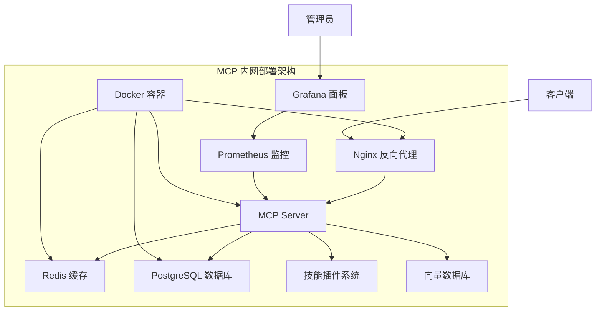

# MCP 内网部署完整指南

## 📖 概述

本指南详细介绍如何在完全离线的内网环境中部署 MCP (Model Context Protocol) 系统。通过本指南，您可以在不连接互联网的情况下搭建一个完整的大模型应用平台。

## 🏗️ 系统架构

### 组件概览



### 核心功能

- **AI Agent 系统** - 智能任务执行
- **技能管理** - 可扩展的技能生态
- **记忆系统** - 持久化知识存储
- **安全控制** - 细粒度权限管理
- **监控告警** - 完整的可观测性

## 📋 环境要求

### 硬件要求

| 组件 | 最小配置 | 推荐配置 |
|------|----------|----------|
| CPU | 2 核心 | 4+ 核心 |
| 内存 | 4GB | 8GB+ |
| 存储 | 20GB | 50GB+ SSD |
| 网络 | 100Mbps | 1Gbps |

### 软件要求

- **操作系统**: CentOS 7+/Ubuntu 18+/RHEL 7+
- **Docker**: 20.10+
- **Docker Compose**: 1.29+
- **内核**: 3.10+

## 🚀 快速部署

### 第一步：准备部署包

在联网环境中执行：

```bash
# 1. 克隆项目
git clone <your-repo-url>
cd Noeverer.github.io

# 2. 执行打包脚本
./mcp-deployment/scripts/package.sh

# 3. 获取部署包
ls dist/mcp-server-*.tar.gz
```

### 第二步：传输到内网环境

```bash
# 使用 U 盘、内网文件传输等方式
scp dist/mcp-server-*.tar.gz user@internal-server:/opt/
```

### 第三步：内网环境部署

```bash
# 1. 解压部署包
cd /opt
tar -xzf mcp-server-*.tar.gz
cd mcp-server-*

# 2. 配置环境变量
vim config/.env

# 3. 执行部署
sudo ./deploy.sh
```

## ⚙️ 详细配置

### 环境变量配置

编辑 `config/.env` 文件：

```bash
# === 基础配置 ===
MCP_VERSION=1.0.0
MCP_ENV=production

# === 安全配置（必须修改）===
MCP_SECRET_KEY=your-very-strong-secret-key-here
MCP_JWT_SECRET=your-jwt-secret-here
MCP_TOKEN_EXPIRY=24h

# === 数据库配置 ===
MCP_DB_TYPE=sqlite                    # 或 postgres
MCP_DB_PATH=/opt/mcp/data/mcp.db

# === 缓存配置 ===
MCP_CACHE_TYPE=redis
MCP_REDIS_HOST=localhost
MCP_REDIS_PORT=6379
MCP_REDIS_PASSWORD=your-redis-password

# === 存储配置 ===
MCP_DATA_DIR=/opt/mcp/data
MCP_LOG_DIR=/opt/mcp/logs
MCP_SKILLS_DIR=/opt/mcp/skills

# === 性能配置 ===
MCP_WORKERS=4
MCP_MAX_CONNECTIONS=1000
MCP_CONNECTION_TIMEOUT=30

# === 功能开关 ===
MCP_FILE_OPERATIONS_ENABLED=true
MCP_CODE_EXECUTION_ENABLED=true
MCP_WEB_SEARCH_ENABLED=false          # 内网环境关闭
```

### 数据库选择

#### SQLite（默认）
- 适合小型部署
- 无需额外配置
- 单机使用

#### PostgreSQL（推荐）
```bash
# 修改环境变量
MCP_DB_TYPE=postgres
MCP_POSTGRES_HOST=localhost
MCP_POSTGRES_PORT=5432
MCP_POSTGRES_USER=mcp
MCP_POSTGRES_PASSWORD=your-db-password
MCP_POSTGRES_DB=mcp
```

### 安全配置

#### 1. 生成强密钥
```bash
# 生成随机密钥
MCP_SECRET_KEY=$(openssl rand -hex 32)
MCP_JWT_SECRET=$(openssl rand -hex 32)

# 更新到配置文件
sed -i "s/MCP_SECRET_KEY=.*/MCP_SECRET_KEY=$MCP_SECRET_KEY/" config/.env
sed -i "s/MCP_JWT_SECRET=.*/MCP_JWT_SECRET=$MCP_JWT_SECRET/" config/.env
```

#### 2. 配置访问控制
```json
// config/mcp-config.json
{
  "security": {
    "authorization": {
      "default_role": "user",
      "roles": {
        "admin": {
          "permissions": ["*"]
        },
        "user": {
          "permissions": ["read", "write", "execute"]
        },
        "guest": {
          "permissions": ["read"]
        }
      }
    },
    "resource_access": {
      "allowed_directories": [
        "/opt/mcp/data",
        "/tmp/mcp",
        "/home/user/projects"
      ],
      "blocked_patterns": [
        "/etc",
        "/usr/bin",
        "/bin",
        "/root"
      ]
    }
  }
}
```

#### 3. 网络访问控制
```nginx
# docker/nginx.conf
server {
    listen 80;
    server_name _;
    
    # IP 白名单
    allow 192.168.1.0/24;
    allow 10.0.0.0/8;
    deny all;
    
    # 其他配置...
}
```

## 🔧 服务管理

### 启动服务

```bash
# 启动所有服务
cd docker
docker-compose up -d

# 启动特定服务
docker-compose up -d mcp-server redis

# 启动可选服务
docker-compose --profile postgres up -d postgres
docker-compose --profile nginx up -d nginx
docker-compose --profile monitoring up -d prometheus grafana
```

### 服务状态检查

```bash
# 检查所有服务状态
docker-compose ps

# 检查特定服务状态
docker-compose ps mcp-server

# 查看服务日志
docker-compose logs -f mcp-server
```

### 健康检查

```bash
# MCP 服务健康检查
curl -f http://localhost:8080/health

# 数据库连接检查
docker-compose exec mcp-server python -c "
import sqlite3
conn = sqlite3.connect('/opt/mcp/data/mcp.db')
print('Database connection successful')
conn.close()
"

# Redis 连接检查
docker-compose exec redis redis-cli ping
```

## 📊 监控和日志

### 日志管理

日志位置：
- 应用日志: `/opt/mcp/logs/mcp-server.log`
- Nginx 日志: `/opt/mcp/logs/nginx.log`
- Supervisor 日志: `/opt/mcp/logs/supervisord.log`

```bash
# 实时查看日志
tail -f /opt/mcp/logs/mcp-server.log

# 查看错误日志
grep ERROR /opt/mcp/logs/mcp-server.log

# 日志轮转配置
logrotate -f /etc/logrotate.d/mcp
```

### 监控配置

#### Prometheus 指标
```bash
# 访问指标端点
curl http://localhost:9090/metrics

# 关键指标
# mcp_requests_total - 请求总数
# mcp_request_duration_seconds - 请求耗时
# mcp_active_connections - 活跃连接数
# mcp_memory_usage_bytes - 内存使用量
```

#### Grafana 面板
- 访问地址: http://localhost:3000
- 默认用户名: admin
- 默认密码: admin123（请立即修改）

预置面板：
- MCP 服务概览
- 系统资源监控
- 技能执行统计
- 错误率和响应时间

## 🛠️ 技能开发

### 技能目录结构

```
/opt/mcp/skills/
├── file_operations/
│   ├── __init__.py
│   ├── skill.py
│   └── config.yaml
├── data_analysis/
│   ├── __init__.py
│   ├── skill.py
│   └── requirements.txt
└── custom_tool/
    ├── __init__.py
    ├── skill.py
    └── README.md
```

### 创建自定义技能

```python
# /opt/mcp/skills/custom_skill/skill.py
from mcp.skills import BaseSkill, SkillMetadata

class CustomSkill(BaseSkill):
    def _define_metadata(self):
        return SkillMetadata(
            name="custom_skill",
            description="自定义技能示例",
            version="1.0.0",
            author="Your Name"
        )
    
    async def execute(self, parameters):
        # 技能核心逻辑
        result = await self.process_data(parameters)
        return result
```

### 技能配置

```yaml
# /opt/mcp/skills/custom_skill/config.yaml
skill:
  name: custom_skill
  enabled: true
  timeout: 30
  
parameters:
  type: object
  properties:
    input:
      type: string
      description: 输入参数
  
permissions:
  - file_read
  - api_call
```

## 🔒 安全最佳实践

### 1. 网络安全

```bash
# 配置防火墙
sudo firewall-cmd --permanent --add-port=8080/tcp
sudo firewall-cmd --permanent --add-port=6379/tcp
sudo firewall-cmd --reload

# 配置 iptables 规则
sudo iptables -A INPUT -p tcp --dport 8080 -s 192.168.1.0/24 -j ACCEPT
sudo iptables -A INPUT -p tcp --dport 8080 -j DROP
```

### 2. 数据加密

```bash
# 生成 SSL 证书
sudo mkdir -p /opt/mcp/ssl
sudo openssl req -x509 -newkey rsa:4096 \
    -keyout /opt/mcp/ssl/key.pem \
    -out /opt/mcp/ssl/cert.pem \
    -days 365 -nodes

# 配置 HTTPS
# 修改 docker/nginx.conf 启用 HTTPS 配置
```

### 3. 访问控制

```json
{
  "security": {
    "authentication": {
      "method": "token",
      "secret_key": "${MCP_SECRET_KEY}",
      "token_expiry": "24h"
    },
    "rate_limit": {
      "enabled": true,
      "requests_per_minute": 100
    }
  }
}
```

## 🚨 故障排除

### 常见问题

#### 1. 服务无法启动

```bash
# 检查端口占用
sudo netstat -tlnp | grep :8080

# 检查 Docker 状态
sudo systemctl status docker

# 查看详细日志
cd docker && docker-compose logs mcp-server
```

#### 2. 数据库连接失败

```bash
# 检查数据库服务状态
docker-compose ps postgres

# 测试数据库连接
docker-compose exec postgres psql -U mcp -d mcp -c "SELECT 1;"

# 检查数据库配置
cat config/.env | grep MCP_DB
```

#### 3. 权限问题

```bash
# 检查目录权限
ls -la /opt/mcp/

# 修复权限
sudo chown -R mcp:mcp /opt/mcp/
sudo chmod -R 755 /opt/mcp/
```

#### 4. 内存不足

```bash
# 检查内存使用
free -h

# 检查容器资源限制
docker stats

# 调整容器资源限制
# 修改 docker-compose.yml 添加 deploy 配置
```

### 性能优化

#### 1. 数据库优化

```sql
-- 创建索引
CREATE INDEX idx_tasks_created_at ON tasks(created_at);
CREATE INDEX idx_memory_session_id ON memory(session_id);

-- 清理过期数据
DELETE FROM memory WHERE created_at < datetime('now', '-30 days');
```

#### 2. 缓存优化

```bash
# 调整 Redis 配置
# 在 docker-compose.yml 中添加 Redis 配置
command: redis-server --maxmemory 1gb --maxmemory-policy allkeys-lru
```

#### 3. 应用优化

```python
# 调整工作进程数
# config/.env
MCP_WORKERS=4  # 根据 CPU 核心数调整

# 调整连接池大小
MCP_DB_POOL_SIZE=20
MCP_REDIS_POOL_SIZE=10
```

## 🔄 升级和维护

### 版本升级

```bash
# 1. 备份数据
sudo cp -r /opt/mcp/data /opt/mcp/data_backup_$(date +%Y%m%d)

# 2. 停止服务
cd docker && docker-compose down

# 3. 更新部署包
# 重新打包并传输新版本

# 4. 执行升级
sudo ./upgrade.sh  # 需要创建升级脚本
```

### 数据备份

```bash
#!/bin/bash
# backup.sh - 数据备份脚本

BACKUP_DIR="/opt/mcp/backups"
DATE=$(date +%Y%m%d_%H%M%S)

# 创建备份目录
mkdir -p $BACKUP_DIR

# 备份数据库
if [ "$MCP_DB_TYPE" = "postgres" ]; then
    docker-compose exec postgres pg_dump -U mcp mcp > $BACKUP_DIR/db_$DATE.sql
else
    cp /opt/mcp/data/mcp.db $BACKUP_DIR/db_$DATE.db
fi

# 备份配置文件
tar -czf $BACKUP_DIR/config_$DATE.tar.gz /opt/mcp/config

# 备份技能
tar -czf $BACKUP_DIR/skills_$DATE.tar.gz /opt/mcp/skills

# 清理旧备份（保留30天）
find $BACKUP_DIR -name "*.sql" -mtime +30 -delete
find $BACKUP_DIR -name "*.db" -mtime +30 -delete
find $BACKUP_DIR -name "*.tar.gz" -mtime +30 -delete
```

### 定期维护

```bash
# 创建定时任务
sudo crontab -e

# 添加以下内容
# 每天凌晨2点执行备份
0 2 * * * /opt/mcp/scripts/backup.sh

# 每周日清理日志
0 3 * * 0 find /opt/mcp/logs -name "*.log" -mtime +7 -delete

# 每月1号检查磁盘空间
0 4 1 * * /opt/mcp/scripts/check_disk_space.sh
```

## 📞 技术支持

### 支持渠道

1. **文档资源**: 查看项目文档和指南
2. **日志分析**: 检查系统日志定位问题
3. **社区支持**: 提交 Issue 到项目仓库

### 问题报告模板

```markdown
## 环境信息
- 操作系统: 
- Docker 版本: 
- MCP 版本: 
- 部署方式: 

## 问题描述
[详细描述遇到的问题]

## 错误信息
[粘贴相关错误日志]

## 复现步骤
1. 
2. 
3. 

## 期望结果
[描述期望的正确行为]
```

---

*本指南持续更新中，如有问题请及时反馈。*