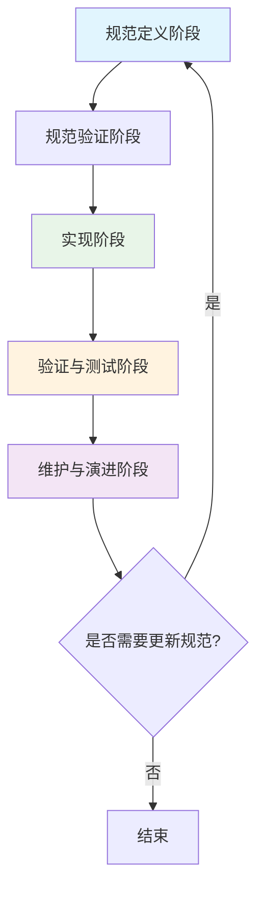

# SDD编程：规范驱动开发详解

## 引言

在现代软件开发中，随着项目规模的增长和业务逻辑的复杂化，如何确保代码质量、提高开发效率以及降低维护成本成为了关键挑战。规范驱动开发（Specification Driven Development，简称SDD）作为一种新兴的开发方法论，旨在通过规范先行的方式，提高软件开发的确定性和可预测性。

本文将深入探讨SDD的概念、工作流程、优势以及实践方法，帮助开发者了解并掌握这一高效的开发方式。

<!--more-->

## 什么是SDD（规范驱动开发）？

SDD（Specification Driven Development）是一种以规范为核心的软件开发方法论。它强调在编写任何功能性代码之前，先明确地定义和描述系统的行为和功能需求。SDD的核心思想是通过形式化的规范来驱动整个开发过程，确保最终的实现完全符合预期。

### SDD与TDD、BDD的区别

虽然SDD与TDD（测试驱动开发）和BDD（行为驱动开发）有相似之处，但它们在理念和实践上存在明显区别：

- **TDD（Test Driven Development）**：通过编写测试用例来驱动代码实现，强调"红-绿-重构"的循环。
- **BDD（Behavior Driven Development）**：关注系统的业务行为，使用自然语言描述功能需求，促进团队沟通。
- **SDD（Specification Driven Development）**：强调先建立完整的功能规范，再进行实现，注重系统性、全面性的需求覆盖。

## SDD的核心原则

### 1. 规范先行

在SDD中，规范是开发过程的核心驱动力。开发人员需要在编写任何功能性代码之前，首先定义清晰、无歧义的规范。

### 2. 完整性保证

SDD要求规范覆盖系统的所有功能和边界情况，确保实现的完整性。

### 3. 可验证性

规范应该是可验证的，每一条规范都应该有对应的验证方法。

### 4. 渐进式细化

规范不是一蹴而就的，而是通过迭代逐步细化和完善。

## SDD的工作流程

SDD的工作流程可以概括为以下几个阶段：

<div align="center">



</div>

### 1. 规范定义阶段

在这个阶段，开发团队与产品负责人、业务专家一起定义系统的功能规范。规范通常包括：

- 功能需求描述
- 输入输出定义
- 边界条件
- 错误处理策略
- 性能要求

### 2. 规范验证阶段

在正式开发之前，需要对规范进行验证，确保：

- 规范的完整性
- 规范的一致性
- 规范的可实现性
- 团队对规范的理解一致性

### 3. 实现阶段

基于验证过的规范进行编码实现。实现过程中需要不断对照规范，确保代码与规范的一致性。

### 4. 验证与测试阶段

验证实现是否完全符合规范，包括：

- 功能验证
- 性能测试
- 边界条件测试
- 错误处理验证

### 5. 维护与演进阶段

在系统运行过程中，根据新的需求或反馈，更新规范并相应调整实现。

## SDD的优势

### 1. 提高开发效率

通过预先定义清晰的规范，开发人员可以更专注于实现细节，减少需求变更带来的返工。

### 2. 改善团队沟通

规范作为共同的语言，有助于不同角色之间的沟通和理解，减少误解。

### 3. 增强代码质量

规范驱动的开发方式有助于编写更健壮、更可靠的代码，减少缺陷。

### 4. 便于维护和扩展

清晰的规范使后续的维护和扩展工作更加容易，新加入的团队成员也能更快上手。

## SDD的实际应用示例

让我们通过一个简单的示例来说明SDD的应用。假设我们要开发一个计算器的加法功能：

### 规范定义

```
### Requirement: Addition Operation
The calculator SHALL perform addition of two numbers correctly.

#### Scenario: Normal Addition
- **WHEN** user inputs two positive integers (e.g., 3 and 5)
- **THEN** the calculator returns their sum (8)

#### Scenario: Negative Numbers
- **WHEN** user inputs one or two negative numbers (e.g., -3 and 5)
- **THEN** the calculator returns the correct result (-3 + 5 = 2)

#### Scenario: Zero Values
- **WHEN** user inputs zero with any number (e.g., 0 and 7)
- **THEN** the calculator returns the other number (7)

#### Scenario: Large Numbers
- **WHEN** user inputs large numbers (e.g., 999999999 and 1)
- **THEN** the calculator handles the calculation without overflow
```

### 实现代码

基于上述规范，我们可以实现加法功能：

```python
def add(a, b):
    """
    Perform addition of two numbers according to specification
    """
    # Validate input types
    if not isinstance(a, (int, float)) or not isinstance(b, (int, float)):
        raise TypeError("Arguments must be numbers")
    
    # Perform addition
    result = a + b
    
    # Return result
    return result

# Test against specification
assert add(3, 5) == 8
assert add(-3, 5) == 2
assert add(0, 7) == 7
assert add(999999999, 1) == 1000000000
```

## SDD的最佳实践

### 1. 使用结构化规范语言

采用结构化的语言和格式来编写规范，如Gherkin语法或类似OpenSpec的格式，确保规范的清晰和可解析性。

### 2. 版本控制规范文档

将规范文档纳入版本控制系统，与代码同步更新，保持一致性。

### 3. 自动化验证

尽可能使用自动化工具验证实现与规范的一致性，减少人工验证的工作量。

### 4. 定期回顾和更新

定期回顾规范的有效性，根据实际使用情况和反馈进行更新。

## 总结

SDD（规范驱动开发）作为一种系统性的开发方法论，通过规范先行的方式提高了软件开发的可控性和可预测性。尽管SDD在初期可能需要更多的准备工作，但从长远来看，它能够显著提高开发效率、改善代码质量和团队协作效果。

对于追求高质量软件开发的团队来说，SDD是一个值得探索和实践的方法论。通过合理应用SDD的原则和实践，我们可以构建更加可靠、可维护的软件系统。

如果你正在寻找提高开发质量的方法，不妨尝试将SDD融入到你的开发流程中，相信你会收获意想不到的效果。